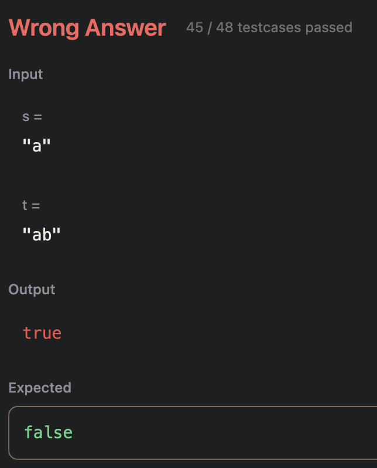

# 242. Valid Anagram
```
Given two strings s and t, return true if t is an anagram of s, and false otherwise.

An Anagram is a word or phrase formed by rearranging the letters of a different word or phrase, typically using all the original letters exactly once.
```

## Attempt 1:
Seems easy enough? I should just start at the beginning of the string and just compare with the last element. Step my way through until we reach the middle. If there are no conflicts, boom we have an anagram! 

Is what I thought... I wrote the solution, and failed. Huh? But it's so simple? I re-read the prompt then realized; I was thinking of a palindrome. I quickly deleted the code and started again. 

## Attempt 2:
Now knowing what an anagram is, I start again. My gut tells me once again HashMap is the solution, and this time it makes more sense since I will actually be counting the elements. 

To be honest, I no longer have the code for this attempt, I was half-way through the code when I thought, there has to be a simpler way, this is way too long. So I started again!

## Attempt 3:
This attempt had to be the simplest of all the solutions. If i just sort the entire array of both, I should be able to just compare them and check if they are the same contents or not. So that's exactly what I implement. 

```java
class Solution {
	public boolean isAnagram(String s, String t) {
		char[] first = s.toCharArray();
		char[] second = t.toCharArray();
		Arrays.sort(first);
		Arrays.sort(second);
		
		if (!Arrays.equals(first, second))
		{
			return false;
		}
		else
		{
			return true;
		}
	}
}
```

I assume Java has a good enough sorting algorithm built in to be fast enough, but it's still O(n log n). There has to be something faster.

## Attempt 4:
Ok, maybe lets revisit the HashMap idea. After reviewing the video, I'm pretty sure I know exactly how to implement this. 

```java
import java.util.HashMap;

class Solution {
	public boolean isAnagram(String s, String t) {
		HashMap<Character, Integer> first = new HashMap<Character, Integer>();
		HashMap<Character, Integer> second = new HashMap<Character, Integer>();
		for (int i = 0; i < s.length(); i++) {
			if (first.get(s.charAt(i)) == null) {
				first.put(s.charAt(i), 1);
			} else {
				first.put(s.charAt(i), first.get(s.charAt(i)) + 1);
			}
		}
		for (int i = 0; i < t.length(); i++) {
			if (second.get(t.charAt(i)) == null) {
				second.put(t.charAt(i), 1);
			} else {
				second.put(t.charAt(i), second.get(t.charAt(i)) + 1);
			}
		}
		for (int i = 0; i < s.length(); i++) {
			if (first.get(s.charAt(i)) != second.get(s.charAt(i))) {
				return false;
			}
		}
		return true;
	}
}
```

Ok, with this code, we should be in a perfectly working state! Let's submit.


Ok, well I can see the issue there. If we just check the length, that should be super easy to fix
```java
if (s.length() != t.length())
{
return false;
}
```

And we fail again? The final testcase is failing. Reason: unknown. I modified the code to operate on the elements in the HashMap instead of the string, hoping that would make a difference

```java
Set<Character> elements = first.keySet();

for(Character element : elements)
{
	if (first.get(element) != second.get(element))
	{
		return false;
	}
}
return true;
}
```

This doesn't change anything, and it still fails on the last case.

After a discussion with CoPilot, I came the solution. `==` is deceiving in Java. Whenever Integer values outside of the range -128 to 127, the == operator functions on reference, not value. To fix this, all that is needed is using the `.equals` operator, giving us the final, working code!

```java
import java.util.HashMap;
import java.util.Set;

class Solution {
    public boolean isAnagram(String s, String t) {
        HashMap<Character, Integer> first = new HashMap<Character, Integer>();
        HashMap<Character, Integer> second = new HashMap<Character, Integer>();
        
        if (s.length() != t.length())
        {
            return false;
        }

        for(int i = 0; i < s.length(); i++)
        {
            if (first.get(s.charAt(i)) == null)
            {
                first.put(s.charAt(i), 1);
            }
            else
            {
                first.put(s.charAt(i), first.get(s.charAt(i)) + 1);
            }
        }

        for(int i = 0; i < t.length(); i++)
        {
            if (second.get(t.charAt(i)) == null)
            {
                second.put(t.charAt(i), 1);
            }
            else
            {
                second.put(t.charAt(i), second.get(t.charAt(i)) + 1);
            }
        }

        Set<Character> elements = first.keySet();

        for(Character element : elements)
        {
            if (!first.get(element).equals(second.get(element)))
            {
                return false;
            }
        }
        return true;
    }
}
```

Funnily enough, this solution scores much worse than the previous attempt in runtime on Leetcode, but theoretically, this should run faster with longer strings.